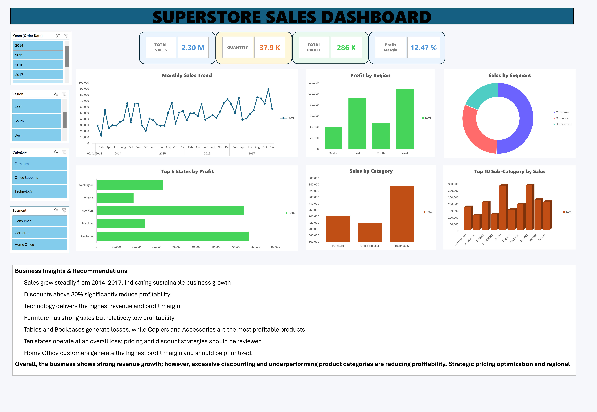

# Superstore Sales Dashboard

An interactive sales dashboard built in **Microsoft Excel (Office 2024)** using PivotTables, PivotCharts, KPIs and Business Intelligence techniques.

---

# Dashboard Preview

> Replace the image path after uploading your dashboard screenshot.



---

# Project Overview

This project analyzes the Superstore sales dataset and transforms raw transactional data into an interactive dashboard that supports business decision-making.

The dashboard allows managers to monitor sales performance, profitability, customer segments, regions and product categories through dynamic filters and KPI cards.

---

# Business Objective

The goal of this project is to:

- Monitor overall sales performance
- Identify profitable and unprofitable products
- Analyze regional performance
- Evaluate customer segments
- Understand the impact of discounts on profitability
- Support data-driven business decisions

---

# Dataset

Source:

Sample Superstore Dataset

The dataset contains information about:

- Orders
- Customers
- Products
- Categories
- Regions
- Sales
- Quantity
- Discount
- Profit

---

# Tools Used

- Microsoft Excel (Office 2024)
- Pivot Tables
- Pivot Charts
- Slicers
- KPI Cards
- Data Cleaning
- Data Visualization

---

# Dashboard Features

- Interactive slicers
- Monthly Sales Trend
- Sales by Category
- Top 10 Sub-Categories
- Top 5 States by Profit
- Profit by Region
- Sales by Customer Segment
- KPI Summary Cards

---

# KPI Summary

- Total Sales
- Total Quantity Sold
- Total Profit
- Profit Margin

---

# Business Insights

### 1. Technology is the most profitable category.

Technology generates the highest sales and profit among all product categories.

---

### 2. Furniture generates high sales but low profitability.

Although Furniture contributes significantly to revenue, its profit margin remains relatively low.

---

### 3. Heavy discounts reduce profitability.

Discounts above **30%** are associated with negative profits in many transactions.

---

### 4. Tables and Bookcases are loss-making products.

These sub-categories consistently produce negative profit despite generating sales.

---

### 5. Copiers and Accessories are the most profitable products.

These products generate the highest profit margins.

---

### 6. Regional performance differs significantly.

The West region delivers the highest overall profit.

---

### 7. Home Office customers generate the highest profit margin.

Among customer segments, Home Office customers are the most profitable.

---

# Business Recommendations

- Reduce discounts greater than 30%.
- Reevaluate pricing strategy for Furniture.
- Optimize inventory for Tables and Bookcases.
- Increase marketing efforts for Copiers and Accessories.
- Focus expansion on high-performing regions.
- Improve promotional strategies based on customer segments.

---

# Repository Structure

```
Dataset/
Dashboard/
Images/
README.md
```

---

# Skills Demonstrated

- Data Cleaning
- Data Analysis
- Dashboard Design
- Business Intelligence
- KPI Development
- Data Visualization
- Microsoft Excel
- Storytelling with Data

---

# Author

Mohammad Safari

LinkedIn:
(Coming Soon)

GitHub:
https://github.com/mmdsfi7

---

⭐ If you found this project useful, feel free to star this repository.
